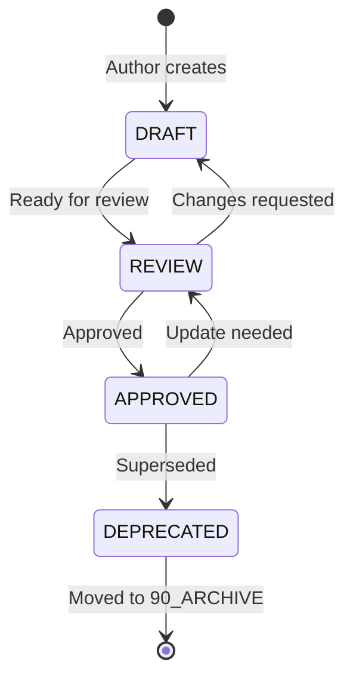

> **BLUF:** NASA/JPL-grade documentation standard for all projects. All docs must use YAML frontmatter, BLUF-first writing, and follow the Indexed Decimal folder structure. Enforces change control (NPR 7150.2D), peer review gates, requirements traceability (DO-178C §6.4), and formal retention/archival policies. Documentation is a first-class deliverable — not an afterthought.

# Documentation Standard

> **"If it isn't documented, it doesn't exist. If it's documented poorly, it's worse than not existing."**

Documentation is designed for **dual-audience** consumption:
1. **Human Architects** — who need to find and scan docs quickly
2. **AI Agents** — who need to parse, filter, and retrieve docs programmatically

---

## 1. Folder Structure

```
CODEX/
├── 00_INDEX/              # Entry point: README + MANIFEST.yaml
├── 10_GOVERNANCE/         # Standards, protocols, architecture decisions
├── 20_BLUEPRINTS/         # Component specs, system designs, API contracts
├── 30_RUNBOOKS/           # Operational how-to guides, deployment, workflows
├── 40_VERIFICATION/       # Test specs, QA standards, validation reports
├── 50_DEFECTS/            # Bug reports, root cause analysis, forensics
├── 60_EVOLUTION/          # Feature specs, enhancements, roadmaps
├── 70_RESEARCH/           # Whitepapers, investigations, POCs
├── 90_ARCHIVE/            # Deprecated and completed docs
└── _templates/            # Doc templates (reference, how-to, tutorial, explanation)
```

### 1.1 Area Rules

- **Numbered prefixes** ensure deterministic sort order (`ls` always returns the same order)
- **Numbers 00–90** in increments of 10, leaving room for future areas
- **One area, one purpose** — no duplicate numbers, no overlapping scope
- **90 is always Archive** — the graveyard for deprecated docs

### 1.2 Domain Interpretation Guide

> 🧠 **Plain English:** The folder categories are **abstract organizational patterns**, not software-specific labels. Agents map them to the project's domain. Humans never interact with the raw CODEX — agents produce output artifacts (PDF, PowerPoint, Excel) on request.

The CODEX is **agent-authored infrastructure** — think of it as source code, not a user manual. The numbered areas and category codes are universal patterns that adapt to any domain:

| Area | Abstract Purpose | 🔧 Engineering | 💼 Sales / Business | 📚 Training / Education | 🏢 Consulting |
|:-----|:----------------|:---------------|:-------------------|:-----------------------|:-------------|
| `10_GOVERNANCE` | **Rules & standards** | Coding standards, ADRs | Sales policies, comp plans, territory rules | Course governance, grading rubrics, academic integrity | Engagement standards, methodology frameworks |
| `20_BLUEPRINTS` | **Plans & designs** | API specs, system designs | Account plans, proposals, deal structures | Curriculum design, lesson plans, learning objectives | Solution architectures, client deliverable specs |
| `30_RUNBOOKS` | **How-to procedures** | Deployment guides, debug runbooks | Sales playbooks, call scripts, onboarding SOPs | Instructor guides, facilitation SOPs, lab setup | Implementation playbooks, workshop facilitation guides |
| `40_VERIFICATION` | **Quality & validation** | Test plans, QA reports | Pipeline audits, forecast reviews, win/loss analysis | Assessment rubrics, quiz banks, evaluation criteria | Quality reviews, deliverable acceptance criteria |
| `50_DEFECTS` | **Problems & fixes** | Bug reports, RCAs | Lost deal post-mortems, churn RCAs, complaint logs | Student feedback, course corrections, content errata | Risk registers, issue logs, lessons learned |
| `60_EVOLUTION` | **Growth & change** | Feature specs, roadmaps | Territory expansion plans, new product launches | Curriculum updates, new module proposals | Scope change requests, follow-on opportunity briefs |
| `70_RESEARCH` | **Discovery & analysis** | Whitepapers, POCs | Market research, competitive intel, industry reports | Pedagogical research, benchmarking studies | Discovery findings, current-state assessments |

#### 1.2.1 Rules for Domain Mapping

1. **Empty folders are fine** — not every project uses every category (same as an empty `tests/` directory)
2. **Agents infer domain context** from the project's `context.md` or initial instructions
3. **Category codes stay the same** — `GOV`, `BLU`, `DEF`, etc. are universal. The *content meaning* adapts, not the code
4. **Output format is decoupled from storage** — agents store as Markdown internally, produce PDF/PPTX/XLSX on human request
5. **When in doubt, use the abstract purpose** column to determine where a document belongs

---

## 2. File Naming

### 2.1 Format

```
[CATEGORY]-[NNN]_[Title].md
```

| Component | Description | Example |
|:----------|:------------|:--------|
| `CATEGORY` | 3-letter code from area's category codes | `GOV`, `BLU`, `VER` |
| `NNN` | 3-digit serial number | `001`, `042`, `100` |
| `Title` | PascalCase description | `DocumentationStandard` |

**Examples:**
- `GOV-001_DocumentationStandard.md`
- `BLU-003_ArbiterSpec.md`
- `VER-010_E2ETestPlan.md`
- `DEF-005_MemoryLeakRCA.md`

### 2.2 Category Codes

| Area | Primary Code | Secondary Code | Description |
|:-----|:-------------|:---------------|:------------|
| 10_GOVERNANCE | `GOV` | `ADR` | Standards, Architecture Decision Records |
| 20_BLUEPRINTS | `BLU` | `API` | Specs, API Contracts |
| 30_RUNBOOKS | `RUN` | `DEP` | Guides, Deployment Procedures |
| 40_VERIFICATION | `VER` | `QA` | Test Specs, Quality Assurance |
| 50_DEFECTS | `DEF` | `RCA` | Defect Reports, Root Cause Analysis |
| 60_EVOLUTION | `EVO` | `RFC` | Feature Specs, Requests for Change |
| 70_RESEARCH | `RES` | `POC` | Research Papers, Proof of Concepts |
| 90_ARCHIVE | `ARC` | — | Archived docs retain their original code |

### 2.3 ID Ranges

| Range | Purpose | Example |
|:------|:--------|:--------|
| **001–009** | Core/foundational documents | `GOV-001_DocumentationStandard` |
| **010–099** | Standard documents | `BLU-012_DatabaseSchema` |
| **100–199** | Extended/supplementary | `RUN-100_DisasterRecovery` |

---

## 3. YAML Frontmatter (Mandatory)

Every `.md` file **MUST** begin with this metadata block:

```yaml
---
id: GOV-001
title: "Documentation Standard"
type: reference              # Diátaxis: reference | how-to | tutorial | explanation
status: DRAFT                # Lifecycle: DRAFT | REVIEW | APPROVED | DEPRECATED
owner: architect             # Who maintains this doc
agents: [all]                # Which agent roles should read this: [all], [coder], [tester], etc.
tags: [documentation, standards]
related: [IDX-000, BLU-003]  # Cross-references to other doc IDs
created: 2026-03-04
updated: 2026-03-04
version: 1.0.0
---
```

### 3.1 Required Fields

| Field | Type | Description |
|:------|:-----|:------------|
| `id` | string | Unique doc ID (`CATEGORY-NNN`) |
| `title` | string | Human-readable title |
| `type` | enum | `reference`, `how-to`, `tutorial`, `explanation` |
| `status` | enum | `DRAFT`, `REVIEW`, `APPROVED`, `DEPRECATED` |
| `owner` | string | Maintainer role or name |
| `agents` | list | Agent roles that should read this doc |
| `tags` | list | Searchable keywords |
| `related` | list | IDs of related documents |
| `created` | date | Creation date |
| `updated` | date | Last modification date |
| `version` | semver | Semantic version (`MAJOR.MINOR.PATCH`) |

### 3.2 The `agents` Field

This field answers: **"Which AI agent roles should care about this doc?"**

| Value | Meaning |
|:------|:--------|
| `[all]` | Every agent should be aware of this doc |
| `[coder]` | Coding agents building the implementation |
| `[tester]` | Testing agents writing/running tests |
| `[researcher]` | Research agents gathering information |
| `[deployer]` | Deployment agents managing releases |
| `[architect]` | The orchestrating agentic architect only |

### 3.3 The `type` Field (Diátaxis)

Choose the type that matches the doc's purpose:

| Type | Purpose | Example |
|:-----|:--------|:--------|
| `reference` | Factual information — specs, APIs, schemas | Component spec, API contract |
| `how-to` | Solve a specific problem — step-by-step | Deployment guide, debug runbook |
| `tutorial` | Learn by doing — guided exercises | "Getting Started" guide |
| `explanation` | Understand why — concepts and decisions | Architecture explanation, ADR |

---

## 4. Content Standards

### 4.1 BLUF (Bottom Line Up Front)

Immediately after frontmatter, every doc **MUST** include a BLUF blockquote:

```markdown
> **BLUF:** [What is this doc? Why does it matter? Key takeaway. Max 3 sentences.]
```

### 4.2 Writing Rules

1. **≤4 sentences per paragraph** — no walls of text
2. **Tables over prose** — structured data belongs in tables
3. **Code blocks specify language** — always include the language identifier
4. **Mermaid diagrams for architecture** — use `graph`, `sequenceDiagram`, `stateDiagram-v2`
5. **File size guidance**:
   - **≤10KB** — ✅ ideal, easy for agents to retrieve and process
   - **10–30KB** — ⚠️ acceptable if the doc covers one cohesive topic
   - **30KB+** — 🔴 must justify — consider splitting into focused pieces

### 4.3 Callout Boxes

Use GitHub-style alerts: `[!NOTE]`, `[!TIP]`, `[!IMPORTANT]`, `[!WARNING]`, `[!CAUTION]`

Include `🧠 **Plain English:**` explanations for complex topics.

---

## 5. MANIFEST.yaml

The `00_INDEX/MANIFEST.yaml` file is the **machine-readable registry** of all documents. It is the single file an agent reads to build a map of the entire knowledge base.

### 5.1 When to Update

- **Creating** a new doc → add an entry (or run `/manage_documents`)
- **Archiving** a doc → update status to `DEPRECATED`, update path to `90_ARCHIVE/`
- **Deleting** a doc → remove entry

---

## 6. Document Lifecycle



### 6.1 Version Numbering (SemVer)

| Change Type | Bump | Example |
|:------------|:-----|:--------|
| Breaking restructure | MAJOR | `1.0.0` → `2.0.0` |
| New section or content | MINOR | `1.0.0` → `1.1.0` |
| Typo fix, clarification | PATCH | `1.0.0` → `1.0.1` |

### 6.2 Archival Protocol

When deprecating a doc:
1. Set `status: DEPRECATED` in frontmatter
2. Add `superseded_by: [NEW-ID]` field to frontmatter
3. Move file to `90_ARCHIVE/`
4. Update MANIFEST.yaml
5. Update README.md master index

---

## 7. Templates

Use the appropriate template from `_templates/` when creating a new doc:

| Template | Diátaxis Type | Use When |
|:---------|:-------------|:---------|
| `template_reference.md` | Reference | Documenting facts: specs, APIs, schemas |
| `template_how-to.md` | How-To | Solving a specific problem step-by-step |
| `template_tutorial.md` | Tutorial | Teaching through guided exercises |
| `template_explanation.md` | Explanation | Explaining concepts and design decisions |

### 7.1 Creating a New Doc

1. Copy the appropriate template to the target area folder
2. Rename using the `[CATEGORY]-[NNN]_[Title].md` convention
3. Fill in all frontmatter fields
4. Write the BLUF
5. Fill content sections (remove irrelevant template sections)
6. Add entry to `00_INDEX/MANIFEST.yaml`
7. Add entry to `00_INDEX/README.md` master index table

---

## 8. Change Control & Configuration Management (NPR 7150.2D Ch.5)

> **All documentation changes are tracked, reviewed, and versioned.** No undocumented changes.

### 8.1 Version Numbering

Follow **Semantic Versioning** for documents:

| Change Type | Version Bump | Example |
|:------------|:-------------|:--------|
| Major restructure, scope change | **X**.0.0 | 1.0.0 → 2.0.0 |
| New sections, significant content additions | x.**Y**.0 | 1.0.0 → 1.1.0 |
| Typo fixes, clarifications, formatting | x.y.**Z** | 1.0.0 → 1.0.1 |

### 8.2 Change Tracking Requirements

1. **Every change** to a document must update the `version` and `updated` fields in frontmatter
2. **Commit messages** must reference the document ID (e.g., `docs(GOV-001): add change control section`)
3. **Git history** serves as the change log — all changes must be committed with descriptive messages per the project's git workflow
4. **No direct edits to APPROVED documents** without version bump

### 8.3 Status Transitions

```
DRAFT → REVIEW → APPROVED → DEPRECATED
  ↑        ↓
  └── (rejected, needs rework)
```

| Transition | Who Can Authorize | Requirement |
|:-----------|:-----------------|:------------|
| DRAFT → REVIEW | Author | Document complete, BLUF present |
| REVIEW → APPROVED | Peer reviewer | Passes compliance checklist (§12) |
| APPROVED → DEPRECATED | Architect | Replacement doc identified or scope no longer relevant |
| Any → DRAFT | Author | Version must be bumped |

---

## 9. Review & Approval Gates (NPR 7150.2D §3.5)

> **No document reaches APPROVED status without peer review.**

### 9.1 Review Requirements

| Document Type | Review Required | Standard |
|:-------------|:---------------|:---------|
| Governance (GOV-*) | **Independent review** by architect or senior | NPR 7150.2D |
| Blueprints (BLU-*) | Peer review by any team member | — |
| Runbooks (RUN-*) | Review by the person who will execute it | — |
| Defect reports (DEF-*) | Self-review with checklist | — |

### 9.2 What Reviewers Check

1. **BLUF accuracy** — Does the BLUF correctly summarize the document?
2. **Frontmatter completeness** — All 11 required fields present and valid?
3. **Technical accuracy** — Are facts, code examples, and references correct?
4. **Cross-references** — Do all `related` IDs resolve to existing documents?
5. **Tag taxonomy** — Are all tags in the controlled vocabulary?
6. **File size** — Within acceptable limits?
7. **Actionability** — Can an agent or human follow this document to completion?

---

## 10. Requirements Traceability (DO-178C §6.4)

Documentation must be **traceable** — every document should be linkable to the requirement or decision that created it.

### 10.1 Traceability Fields

The `related` field in frontmatter provides forward and backward traceability:

```yaml
# Example: A test spec traces to the feature it verifies
related: [BLU-005, GOV-002]  # BLU-005 = feature spec, GOV-002 = testing protocol
```

### 10.2 Traceability Rules

1. **Every Verification document** (40_VERIFICATION) must trace to the Blueprint or Governance doc it validates
2. **Every Defect document** (50_DEFECTS) must trace to the component or feature affected
3. **Every Evolution document** (60_EVOLUTION) must trace to the requirement or user request that drives it
4. **Bidirectional links** are preferred — if A references B, B should reference A in its `related` field

---

## 11. Retention & Archival Policy (NPR 7150.2D Ch.6)

### 11.1 Archival Triggers

| Trigger | Action |
|:--------|:-------|
| Document replaced by newer version | Move to `90_ARCHIVE/`, set status to `DEPRECATED` |
| Feature/component removed from project | Move to `90_ARCHIVE/`, set status to `DEPRECATED` |
| Document not updated for 6+ months | Review for relevance. Archive if no longer needed. |
| Project phase completed (e.g., POC → Production) | Archive POC-specific docs |

### 11.2 Archival Process

1. Set `status: DEPRECATED` in frontmatter
2. Add a deprecation notice after the BLUF:
   ```markdown
   > ⚠️ **DEPRECATED**: This document has been superseded by [NEW-DOC-ID]. Retained for historical reference.
   ```
3. Move file to `90_ARCHIVE/` folder
4. Update MANIFEST.yaml (status change, path change)
5. Remove from `README.md` active index, add to archive section

### 11.3 Retention

- **Archived docs are never deleted** — they serve as historical reference
- **Git history** preserves the full evolution of every document
- **Minimum retention**: Lifetime of the project. Safety-critical docs: permanent.

---

## 12. AI Agent Instructions

When generating or editing documentation in this system:

1. **Always update frontmatter** — increment version, update `updated` date
2. **Always update MANIFEST.yaml** — keep the registry in sync with reality
3. **Respect the type classification** — don't put step-by-step procedures in a `reference` doc
4. **Use the `agents` field** — tag docs so other agents can filter effectively
5. **Link via `related` field** — build the knowledge graph through explicit cross-references
6. **Stay under 10KB** — split large docs rather than creating monoliths
7. **BLUF first** — every doc must be scannable in 10 seconds
8. **Follow change control** — bump version, descriptive commit message (§8)
9. **Flag for review** — new Governance docs require independent review (§9)
10. **Maintain traceability** — populate `related` field bidirectionally (§10)

---

## 13. Compliance Checklist

Before marking any doc as APPROVED:

- [ ] YAML frontmatter complete with all 11 required fields
- [ ] BLUF present immediately after frontmatter (≤3 sentences)
- [ ] `type` field matches actual doc content
- [ ] `agents` field populated
- [ ] `tags` field has ≥2 relevant keywords from TAG_TAXONOMY.yaml
- [ ] All tags exist in the controlled vocabulary (§ TAG_TAXONOMY)
- [ ] File size reviewed (≤10KB ideal, 10–30KB acceptable, 30KB+ needs justification)
- [ ] No placeholder text (TODO, TBD)
- [ ] Mermaid diagrams render correctly
- [ ] Entry added to MANIFEST.yaml
- [ ] Entry added to README.md master index
- [ ] `related` field populated with bidirectional cross-references (§10)
- [ ] Version bumped appropriately (§8.1)
- [ ] Peer review completed per §9
- [ ] Change committed with descriptive message referencing doc ID

---

> **"Documentation is not about recording what you did. It's about enabling what comes next."**
