> **BLUF:** NASA/JPL-grade testing protocol defining 14 test categories, bidirectional requirements traceability, assertion density mandates, MC/DC coverage, and forensic artifact requirements. An agent reading this document knows exactly what to build, what tools to use, and what "done" looks like.

# Testing Protocol: The Proving Ground

> **"Untested code is broken code. A test that passes randomly is a prayer, not proof."**

---

## 1. The Testing Laws

1. **Trust No Return Value** — A function saying "success" is unverified. Query state to prove it.
2. **The Artifact IS The Proof** — The output of a test is not "PASSED". It's a forensic report.
3. **Zero-Error Tolerance** — A single `ERROR` or `CRITICAL` log during any test = automatic failure, regardless of assertions passing.
4. **No Report = No Pass** — A test that produces no artifact is invalid. Reports are mandatory.
5. **Fail Fast, Fail Loud** — Tests run in order from fastest to slowest. First failure halts the cascade.
6. **Isolation Is Non-Negotiable** — Each test starts clean, runs in isolation, leaves no side effects.
7. **Trace Everything** — Every test must trace back to a requirement. Every requirement must trace forward to a test. (DO-178C §6.4)
8. **Assert Densely** — Minimum 2 assertions per function under test. Assertions remain active in production. (NASA JPL Power of Ten, Rule 5)
9. **Flaky = Broken** — A test that fails intermittently is quarantined immediately. No flaky tests in the main suite.

---

## 2. The Testing Pyramid

All test categories below are defined in order of execution (fastest → slowest). **An agent implementing testing for a new project must evaluate each tier and implement all that apply.**

```mermaid
graph TD
    subgraph "Execution Order — Fast → Slow"
        A["1. IaC & Environment Tests"] --> B["2. Phase 1: Static Fortress"]
        B --> C["3. Unit Tests"]
        C --> D["4. Property-Based Tests"]
        D --> E["5. Snapshot Tests"]
        E --> F["6. Mutation Tests"]
        F --> G["7. Integration Tests"]
        G --> H["8. Contract Tests"]
        H --> I["9. Fuzz Tests"]
        I --> J["10. End-to-End (E2E) Tests"]
        J --> K["11. Dynamic Security & Pen Tests"]
        K --> L["12. GUI, Visual & i18n Tests"]
        L --> M["13. Performance & Scalability Tests"]
        M --> N["14. Chaos & Resilience Tests"]
        N --> O["15. Soak / Endurance Tests"]
        O --> P["16. User Acceptance Testing (UAT)"]
        P --> Q["17. Hardware-in-the-Loop (HIL)"]
    end
```



---

## 3. Infrastructure-as-Code (IaC) Testing — "The Foundation"

Tests the definition files (Terraform, Ansible, Kubernetes, Docker) that build the environment the code will run in.

**When required**: Any project that defines its own infrastructure or deployment containers.

**Tools**: checkov, tfsec, Ansible Lint, Kubeval.

---

## 4. Phase 1: Static Fortress — "The Gatekeeper"

Inspects code **without executing it**. Catches ~40% of bugs in milliseconds. This acts as a strict gate: all tools must pass with zero errors before execution tests begin.

| Tool | Configuration | Target & Threshold |
|:-----|:--------------|:-------------------|
| **Linter** (Ruff, ESLint) | `ruff check` | Zero warnings. |
| **Type Checker** (MyPy, tsc) | `mypy --strict` | **Zero errors.** All public functions must have type annotations. Replace `Any` with concrete types. Requires `py.typed` marker. |
| **Complexity Analyzer** (Radon) | `radon cc -s -n C` | **No function >10 (Grade C or worse).** Functions >10 must be refactored. |
| **Dead Code Detector** (Vulture) | `vulture --min-confidence 80` | **Zero unused code** at ≥80% confidence. |
| **Security Scanner** (Bandit) | `bandit -ll` | **Zero HIGH/CRITICAL findings** (Medium+ severity scan). |
| **Dependency Audit** (pip-audit) | `pip-audit` | **Zero known vulnerabilities.** |
| **Coverage** (Coverage.py) | Line/branch coverage | **≥80% line coverage.** |

**Execution**: The Static Fortress must run **first** in every pipeline (e.g., as separate sub-phases in `test_server.py`). If any tool fails, the pipeline halts.

**Agent Rule**: When setting up a new project or fixing technical debt, expand the test server to run ALL these static analysis tools as separate sub-phases. Fix every error to zero before progressing.

---

## 5. Unit Tests — "The Logic Check"

Validate **isolated functions** with no external dependencies.

| Principle | Rule |
|:----------|:-----|
| **AAA Pattern** | Arrange → Act → Assert |
| **Single Responsibility** | One test = One behavior |
| **Fast Execution** | < 100ms per test |
| **No Side Effects** | No network, no disk, no database |
| **External deps mocked** | All I/O boundaries mocked |
| **Assertion density** | ≥2 assertions per test function (NASA JPL Rule 5) |

**Tools**: pytest, Jest, JUnit, Go testing — whatever matches the project language.

**Coverage minimum**: ≥80% line coverage. 100% for shared/common libraries.

**Agent Rule**: Every public function must have at least one unit test. Safety-critical functions must have boundary and error-path tests.

---

## 6. Property-Based Tests — "The Edge-Case Hunter"

Instead of testing specific inputs, **define invariants** and let the framework generate thousands of random inputs including edge cases (NaN, Infinity, empty, zero, negative, huge).

```python
# Example: Hypothesis (Python)
from hypothesis import given, strategies as st

@given(value=st.floats(allow_nan=True, allow_infinity=True))
def test_clamp_always_bounded(value):
    result = clamp(value, min_val=-100, max_val=100)
    assert -100 <= result <= 100
```

**When required**:
- All validation/sanitization functions
- All numeric processing (clamping, scaling, conversion)
- All data model validators

**Tools**: Hypothesis (Python), fast-check (JS), QuickCheck (Haskell/Go)

---

## 7. Snapshot Tests — "The Drift Detector"

Serialize complex outputs and compare against saved baselines. Detects unintended schema or output changes.

**When required**:
- Data model serialization formats (API responses, database schemas)
- Configuration file outputs
- UI component renders

**Tools**: Syrupy (Python), Jest Snapshots (JS)

```bash
# Update snapshots after intentional changes
pytest tests/snapshot/ --snapshot-update
```

---

## 8. Mutation Tests — "The Test Quality Auditor"

Measures test **quality**, not just coverage. Makes small changes to source code ("mutants") and checks if tests catch them.

| Mutation Type | Original | Mutated | Tests... |
|:--------------|:---------|:--------|:---------|
| Arithmetic | `a + b` | `a - b` | Math correctness |
| Comparison | `x > 0` | `x >= 0` | Boundary handling |
| Boolean | `return True` | `return False` | Control flow |
| Constant | `MAX = 100` | `MAX = 200` | Config assertions |

**Target**: ≥80% mutation kill rate. 100% for safety-critical code.

**Tools**: mutmut (Python), Stryker (JS/TS), PIT (Java)

---

## 9. Integration Tests — "The Wiring Check"

Validates that **two or more components** communicate correctly.

| Scope | What It Validates |
|:------|:------------------|
| API roundtrip | Request → Handler → Response → Client |
| Database I/O | Writes persist, reads return correct data |
| Message queue | Producer → Queue → Consumer |
| Service-to-service | Service A call → Service B response |

**Principle**: Use **real** dependencies where possible (real database, real queue). Mock only external third-party services.

---

## 10. Contract Tests — "The Handshake Verifier"

Ensures producers and consumers agree on API/message schemas. Critical for microservices and multi-agent systems.

```python
def test_api_response_contract(snapshot):
    """Producer and Consumer agree on response schema."""
    schema = ResponseModel.model_json_schema()
    assert schema == snapshot
```

**When required**: Every inter-service API, every message format agents exchange.

**Tools**: Pact, schema snapshot comparisons

---

## 11. Fuzz Tests — "The Crash Finder"

Inject random/malformed inputs into parsers, APIs, and deserializers.

**Goal**: Target must survive **millions of random inputs** without crashing, hanging, or leaking memory.

**When required**: All message parsers, all API endpoints accepting external input, all file parsers.

**Tools**: Atheris (Python), AFL (C/C++), go-fuzz (Go)

---

## 12. End-to-End Tests — "The Full Stack Proof"

Run the **entire system** from input to output.

**Requirements**:
- Every major user flow / system mode must have at least one E2E test
- E2E tests must generate forensic reports (see §15)
- All subprocess launches must use process isolation

**Process Isolation**: Each component under test runs with its own working directory, its own data directory, and communicates only through defined interfaces (API, queue, socket). No shared filesystem side-channels.

---

## 13. Dynamic Security & Penetration Testing — "The Breach Simulator"

Beyond static scanning, this tests the running, integrated application for live exploits.

| Methodology | Purpose |
|:------------|:--------|
| **DAST (Dynamic Application Security Testing)** | Automatically interacts with the running app from the outside to find runtime vulnerabilities (XSS, SQLi, CSRF). |
| **Penetration Testing (Pen Testing)** | Manual or automated ethical hacking attempts using real-world attack vectors. |

**Goal**: Discover zero-day logic flaws and environment-specific bypasses that static scanning inherently misses.

**Tools**: OWASP ZAP, Burp Suite.

---

## 14. GUI, Visual & l10n Tests — "The Pixel Proof"

For projects with user interfaces, verify actual rendered output, visual consistency, and (optionally) accessibility compliance. This tier validates what the user actually **sees and clicks** — not just what the API returns.

**When required**: Any project with a web frontend, desktop UI, or mobile interface.

### 14.1 Default Framework: Playwright

**Playwright** (`@playwright/test`) is the default E2E and GUI testing framework for all web projects. It provides:
- True cross-browser testing (Chromium, Firefox, WebKit) from a single API
- Built-in auto-waiting (no manual `sleep()` hacks)
- Native screenshot comparison (`toHaveScreenshot()`)
- Trace files for post-mortem debugging
- 92% test stability rate (vs. ~81% for Cypress)
- Free parallelization without paid services

**Other tools** (Cypress, Selenium) are acceptable only with documented justification.

### 14.2 Test Structure: Page Object Model

All GUI tests **must** use the Page Object Model (POM) pattern:

```typescript
// pages/login.page.ts
export class LoginPage {
  constructor(private page: Page) {}

  async goto() { await this.page.goto('/login'); }

  async login(email: string, password: string) {
    await this.page.fill('[data-testid="email"]', email);
    await this.page.fill('[data-testid="password"]', password);
    await this.page.click('[data-testid="sign-in"]');
  }
}
```

**Rules:**
- One Page Object per distinct page or major component
- Page Objects encapsulate selectors — test files never contain raw selectors
- Selectors use `data-testid` attributes (resilient to CSS/structure changes)
- If the frontend lacks `data-testid` attributes, **add them** — they are invisible to users

### 14.3 Selector Strategy

| Priority | Method | Example | When |
|:---------|:-------|:--------|:-----|
| 1 | `data-testid` | `[data-testid="submit-btn"]` | Default — always prefer |
| 2 | ARIA role + name | `getByRole('button', { name: 'Submit' })` | Accessible elements |
| 3 | Text content | `getByText('Sign In')` | Visible, stable labels |
| 4 | CSS selector | `.nav-item:first-child` | Last resort only |

**Never use:** XPath, auto-generated class names (e.g., `css-1k4bjh`), or positional indexes.

### 14.4 Screenshot & Trace Capture

Every GUI test run must produce visual evidence per §20.

| Artifact | When Captured | Format | Storage |
|:---------|:-------------|:-------|:--------|
| **Step screenshots** | Every major action | PNG | `tests/artifacts/e2e/screenshots/{flow}/{step}.png` |
| **Failure screenshots** | On assertion failure | PNG | Attached to HTML report |
| **Trace files** | On first retry | ZIP (Playwright trace) | `tests/artifacts/e2e/traces/{test-name}.zip` |
| **Video** | On first retry | WebM | `tests/artifacts/e2e/videos/` |

**Playwright config for artifact capture:**

```typescript
use: {
  screenshot: 'on',          // Every test step
  trace: 'on-first-retry',   // Full trace on failure
  video: 'on-first-retry',   // Video on failure
}
```

**Viewing trace files:** `npx playwright show-trace <trace.zip>` opens an interactive viewer with DOM snapshots, network log, console log, and action timeline.

### 14.5 Error Reporting

GUI tests must produce an **HTML forensic report** (Playwright's built-in reporter):

```typescript
reporter: [
  ['html', { outputFolder: './artifacts/reports' }],
  ['list'],  // Console output
]
```

The HTML report includes:
- Pass/fail status for every test
- Step-by-step screenshots
- Error messages with stack traces
- Attached trace files for failed tests
- Execution time per test

**Agent Rule:** After every test run, the report at `artifacts/reports/index.html` must be reviewable. "The tests passed" without a viewable report is not acceptable (Law #4).

### 14.6 Visual Regression (Free Tier)

Use Playwright's built-in `toHaveScreenshot()` for visual regression — no paid tools required:

```typescript
await expect(page).toHaveScreenshot('dashboard-loaded.png', {
  maxDiffPixelRatio: 0.01,  // Allow 1% pixel variance
});
```

**Rules:**
- Baseline screenshots are committed to the repository
- Update baselines intentionally: `npx playwright test --update-snapshots`
- CI fails if screenshots differ beyond threshold
- Projects requiring advanced visual AI (pixel-level diff, cross-browser rendering) may adopt Percy or Applitools with documented justification

### 14.7 Execution Targets

GUI tests should support multiple execution targets via environment variable:

```bash
# Local development
BASE_URL=http://localhost:3000 npx playwright test

# Staging/Production smoke
BASE_URL=https://staging.example.com npx playwright test

# CI pipeline
BASE_URL=http://app:3000 npx playwright test
```

| Target | Purpose | Frequency |
|:-------|:--------|:----------|
| Local dev | Developer feedback | On demand |
| CI pipeline | Gate before merge | Every PR |
| Production | Post-deploy smoke test | After every deploy |

### 14.8 Additional Techniques

| Technique | What It Catches | Tool | Required? |
|:----------|:----------------|:-----|:----------|
| Screenshot comparison | Visual regressions | Playwright `toHaveScreenshot()` | Yes (for GUI projects) |
| Element presence | Missing UI components | Playwright assertions | Yes |
| Accessibility scanning | WCAG compliance | `@axe-core/playwright` | Recommended (required for public-facing apps) |
| Localization (l10n/i18n) | UI breaks across languages, currencies, time zones | Manual + Playwright | When applicable |

**Tools**: Playwright (default), axe-core (accessibility), Percy/Applitools (advanced visual; optional/paid)

---

## 15. Performance & Scalability Tests — "The Pressure Gauge"

Verify speed, responsiveness, and stability of the application under various conditions.

| Test Type | Definition |
|:----------|:-----------|
| **Baseline Performance** | Speed and responsiveness under normal operations. Define latency budgets. |
| **Load Testing** | System behavior under expected peak user loads. |
| **Stress Testing** | Pushing the system beyond expected limits until it breaks, establishing the upper boundary. |
| **Spike Testing** | Hitting the system with a massive, sudden surge of traffic (e.g., flash sales). |

```bash
# Save baseline
pytest tests/performance/ --benchmark-save=baseline

# Compare — fail if 10% slower
pytest tests/performance/ --benchmark-compare=baseline --benchmark-compare-fail=min:10%
```

**Agent Rule**: Any commit that makes code 10% slower than baseline = pipeline failure.

**Tools**: pytest-benchmark, k6, Locust, wrk

---

## 16. Chaos & Resilience Tests — "The Torture Chamber"

Intentionally **break things** to verify graceful degradation and operational recovery.

| Scenario | Method | Success Criteria |
|:---------|:-------|:-----------------|
| Disaster Recovery / Failover | Force critical database or router to fail | Backup system takes over seamlessly with no data loss |
| Process death | `kill -9` a critical service | System detects loss, degrades gracefully |
| Latency spike | Inject 2-5 second delays | Other components remain responsive |
| Resource exhaustion | Consume all RAM/CPU | System sheds load, core survives |
| Network partition | Disconnect components | Graceful reconnection, no data loss |

---

## 17. Soak / Endurance Tests — "The Marathon"

Run the system under normal load for **extended periods** (hours to days) to detect:
- Memory leaks
- File handle exhaustion
- Database growth / bloat
- Performance degradation over time
- Resource contention under sustained load

**Output**: Soak reports with resource usage graphs over time.

---

## 18. User Acceptance Testing (UAT) — "The Business Sign-Off"

Real users or stakeholders perform exploratory or structured testing on an RC
(Release Candidate) build to confirm it solves the original business problem.

**Requirement**: While automated E2E proves the *spec* works, UAT proves the
spec was *correct*.

> **This tier is MANDATORY before any release tag.** UAT is not optional, not
> "nice to have," and not something you skip because the automated tests pass.

### 18.1 UAT Requirements

1. **Human runs the binary** — The Human (or designated tester) must run the
   compiled binary on their own machine, not in the development environment.
2. **First-run experience** — Test the most common invocation a new user would
   try. If this fails, the release fails.
3. **Cross-platform** — If the project targets multiple OS, UAT must cover at
   least one non-development OS (e.g., if developed on Linux, test on Windows
   or macOS).
4. **No coaching** — The Human should be able to use the tool from the help
   output and documentation alone. If they can't, the UX is broken.
5. **Written signoff** — The Human explicitly approves ("tag it") before any
   release tag is created. The Architect may not tag without this.

### 18.2 UAT Failure Protocol

If UAT fails:
1. Architect files a `DEF-` doc with the exact failure
2. Architect creates a sprint to fix
3. Developer fixes, all automated tests re-run
4. UAT repeats from step 1
5. No release until UAT passes

---

## 18A. Production Smoke Tests — "The Deployment Proof"

> **Added in response to DEF-002.** v1.1 shipped with defects that would have
> been caught by a 30-second smoke test after deployment.

**When required**: After EVERY production deployment. Not optional.

**Who runs them**: The Architect, immediately after deployment completes.

### 18A.1 Smoke Test Requirements

Production smoke tests verify that the deployed system actually works end-to-end
over the real network. They are NOT the same as E2E tests (which run in-process
on localhost).

| # | Test | What It Proves |
|:--|:-----|:---------------|
| 1 | Health endpoint responds | Server is running |
| 2 | Client connects with default flags | SSH connection works over internet |
| 3 | Tunnel is created | Registration and naming work |
| 4 | HTTP request through tunnel returns response | Full proxy pipeline works |
| 5 | Metrics/admin endpoint reflects the request | Observability works |
| 6 | TLS handshake (if enabled) | Certificates are valid |

### 18A.2 Smoke Test Execution

Smoke tests must be run from a **different machine** than the server. Testing
from localhost does not prove network connectivity.

```bash
# Example smoke test script (adapt per project)
# Run from a client machine, NOT from the server

# 1. Health check
curl -f https://tunnel.example.com/api/v1/health

# 2. Connect client and create tunnel
./fonzygrok --server example.com --token $TOKEN --port 8080 --name smoke-test &
sleep 3

# 3. Verify tunnel works
curl -f https://smoke-test.tunnel.example.com/
# Expected: response from localhost:8080

# 4. Check metrics
curl -f https://tunnel.example.com/api/v1/tunnels | grep smoke-test

# 5. Clean up
kill %1
```

### 18A.3 Failure Protocol

If any smoke test fails:
1. **Deployment is NOT complete** — do not announce, do not close the sprint
2. Architect files a `DEF-` with the exact failure and server logs
3. Rollback to previous version if the failure is user-facing
4. Fix → redeploy → re-smoke — loop until all pass

---

## 19. Hardware-in-the-Loop (HIL) — "The Final Gate"

For projects with physical hardware components. Run code on actual embedded hardware with simulated I/O.

**When required**: IoT, robotics, embedded systems, hardware control software.

---

## 20. Test Artifacts & Forensic Reports

> **"No Report = No Pass."**

Every test run must produce artifacts:

```
tests/artifacts/
├── master_report.md              # Overall summary
├── static/                       # Linter, type checker, security reports
├── unit/                         # Individual unit test reports
├── integration/                  # Integration test evidence
├── e2e/                          # E2E reports + screenshots
├── performance/                  # Benchmark results
└── chaos/                        # Resilience test reports
```

### Master Report Requirements

| Section | Content |
|:--------|:--------|
| Header | Timestamp, git commit, branch |
| Test Matrix | Table of all test types with PASS/FAIL |
| Failure Details | Test name, error, link to individual report |
| Coverage Summary | Line %, branch %, mutation score |
| Verdict | Overall PASS/FAIL |

### Individual Test Report Requirements

1. **Metadata**: Name, category, duration, timestamp
2. **Assertions made**: What was verified
3. **Evidence**: State snapshots, database queries, screenshots
4. **Log summary**: Error count, warning count, relevant excerpts
5. **Verdict**: PASS/FAIL with reason

---

## 21. Execution Order (Fail-Fast Cascade)

```
1. IaC & Env Tests       → Fastest. Validates Terraform/K8s/Ansible.
2. Static Fortress       → Fastest. Catches typos, types, security.
3. Unit Tests            → Fast. Catches logic errors.
4. Property Tests        → Catches edge cases.
5. Snapshot Tests        → Catches drift.
6. Mutation Tests        → Catches weak tests.
7. Integration Tests     → Catches wiring errors.
8. Contract Tests        → Catches schema disagreements.
9. Fuzz Tests            → Catches parser crashes.
10. E2E Tests            → Slow. Full stack validation.
11. Dynamic Security     → Catches runtime exploits via DAST.
12. GUI/Visual/i18n      → Catches visual regressions and localization errors.
13. Perf/Scalability     → Catches speed regressions under varying loads.
14. Chaos/Resilience     → Verifies Disaster Recovery and failover logic.
15. Soak Tests           → Catches long-duration issues (leaks).
16. UAT                  → Manual. Validates business requirements.
17. Hardware-in-Loop     → Validates embedded physical assets.
```

**Rule**: If any tier fails, all subsequent tiers are skipped. Fix the fastest-failing tier first.

---

## 22. Requirements Traceability (DO-178C §6.4)

> **"If you can't trace a test to a requirement, why does the test exist? If a requirement has no test, how do you know it works?"**

Every test must have **bidirectional traceability**:

```
Requirement → Design → Code → Test → Test Result
     ↑___________________________________________↓
```

### Implementation

Use the `Refs:` field in test docstrings to link back to CODEX docs:

```python
def test_token_refresh():
    """Verify JWT refresh within sliding window.
    
    Refs: EVO-012, BLU-005
    Requirement: Users must not be logged out during active sessions.
    """
```

### Traceability Matrix

Maintain a traceability matrix (in `CODEX/40_VERIFICATION/`) mapping:

| Requirement ID | Requirement | Test File | Test Function | Status |
|:---------------|:------------|:----------|:--------------|:-------|
| EVO-012 | Session persistence | test_auth.py | test_token_refresh | ✅ |
| BLU-005 | API auth spec | test_auth.py | test_jwt_validation | ✅ |

**Agent Rule**: When creating tests, ALWAYS link to the requirement being verified. When creating requirements, ALWAYS verify a test exists or create one.

---

## 23. Coverage Thresholds

| Metric | Standard | Safety-Critical | Enforcement |
|:-------|:---------|:----------------|:------------|
| Line coverage | ≥80% | ≥95% | CI blocks merge |
| Branch coverage | ≥75% | ≥90% | CI blocks merge |
| Function coverage | 100% public | 100% all | CI blocks merge |
| Mutation score | ≥80% | ≥95% | CI blocks merge |
| MC/DC coverage | N/A | **Required** | CI blocks merge |
| Assertion density | ≥2 per test | ≥3 per test | Linter warns |

### MC/DC Coverage (DO-178C DAL-A)

For safety-critical code paths, **Modified Condition/Decision Coverage** is required. Each condition in a boolean decision must independently affect the outcome:

```python
# Decision: if (A and B) or C
# MC/DC requires proving each condition independently flips the result:
# Test 1: A=T, B=T, C=F → True   (baseline)
# Test 2: A=F, B=T, C=F → False  (A independently affects result)
# Test 3: A=T, B=F, C=F → False  (B independently affects result)  
# Test 4: A=F, B=F, C=T → True   (C independently affects result)
```

**When required**: Any function controlling safety, authorization, financial transactions, or destructive operations.

---

## 24. Regression Testing Policy

Every **bug fix** must include a regression test that:
1. **Reproduces** the original failure (test fails without the fix)
2. **Verifies** the fix (test passes with the fix)
3. **Remains** in the suite permanently — never deleted

```python
def test_regression_issue_42_null_token():
    """Regression: null tokens caused 500 error.
    
    Refs: DEF-042
    Fixed: 2026-03-04
    """
    response = api.refresh(token=None)
    assert response.status_code == 401  # Not 500
```

**Agent Rule**: When fixing a bug, the FIRST step is writing a failing test. The LAST step is confirming it passes.

---

## 25. Flaky Test Quarantine

A test that passes sometimes and fails sometimes is **broken**, not "intermittent."

| Action | When |
|:-------|:-----|
| **Quarantine immediately** | Mark with `@pytest.mark.quarantine` or equivalent |
| **Investigate within 48h** | Root cause: race condition? Timing? Shared state? |
| **Fix or delete** | No test stays quarantined for more than 1 sprint |
| **Never ignore** | A flaky test that's ignored will mask real failures |

Common flaky test causes:
- Shared mutable state between tests (fix: proper teardown)
- Timing-dependent assertions (fix: use polling/retries with timeouts)
- Port conflicts (fix: random port allocation)
- File system race conditions (fix: temp directories per test)

---

## 26. Test Environment Reproducibility

> **"If I can't reproduce your test result on a clean machine, your test is worthless."**

| Requirement | How |
|:------------|:----|
| **Pinned dependencies** | Lockfiles (`poetry.lock`, `package-lock.json`) committed |
| **Deterministic seeds** | Random seeds fixed and logged for reproducibility |
| **Isolated temp dirs** | Each test run uses fresh `tempfile.mkdtemp()`, cleaned after |
| **No host-dependent paths** | Use relative paths or env vars, never hardcoded absolutes |
| **CI = Local parity** | Tests must pass identically in CI and on developer machines |
| **Documented env setup** | `CODEX/30_RUNBOOKS/` contains test environment setup guide |

---

## 27. Test Independence & Review

> NASA IV&V mandates that critical test verification be performed by someone other than the author.

| Practice | Rule |
|:---------|:-----|
| **Tests written by non-author** | For safety-critical code, tests should be written or reviewed by a different agent/person than the code author |
| **Peer review of test logic** | Test assertions reviewed for correctness, not just code coverage |
| **No self-verifying PRs** | The agent that wrote the code should not be the sole reviewer of its tests |

---

## 28. Agent Instructions

When an architect asks you to "set up testing" or "add tests," follow this checklist:

1. **Read this protocol** — understand all 17 tiers + requirements traceability
2. **Assess applicability** — not every project needs HIL or chaos tests, but tiers 1-9 are almost always required
3. **Start from the top** — implement static analysis first, then unit, then work down
4. **Create the artifact directory structure** (§20)
5. **Configure pytest markers** or equivalent:
   ```ini
   [pytest]
   markers =
       unit: Pure unit tests (no I/O)
       integration: Multi-component tests
       e2e: Full system tests
       slow: Tests > 1 second
       safety: Safety-critical path tests
       quarantine: Flaky tests under investigation
   ```
6. **Set up coverage** with minimum thresholds (§23)
7. **Create traceability matrix** linking requirements to tests (§22)
8. **Add to CI pipeline** in fail-fast order (§21)
9. **Ensure assertion density** ≥2 per test function
10. **Pin all dependencies** with lockfiles for reproducibility (§26)
11. **Update `CODEX/00_INDEX/MANIFEST.yaml`** when test specs are created

---

> **"We choose to do the hard things not because they are easy, but because the easy things make systems crash in production."**
