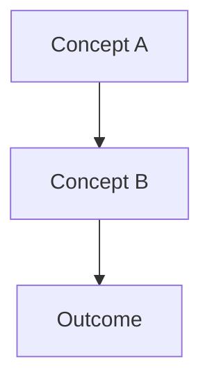

> **BLUF:** [What concept does this explain? Why does it matter? One key insight.]

# Understanding [X]

## 1. The Problem

[What problem or gap in understanding does this address? Set the context.]

---

## 2. The Core Idea

[Explain the fundamental concept. Use analogies. Keep paragraphs short (≤4 sentences).]

> [!TIP]
> 🧠 **Plain English:** [Accessible analogy for the core concept.]

---

## 3. How It Works

[Deeper technical explanation. Use diagrams to illustrate relationships.]

---

## 4. Trade-offs & Alternatives

[What are the trade-offs of this approach? What alternatives were considered?]

| Approach | Pros | Cons |
|:---------|:-----|:-----|
| | | |

---

## 5. Key Takeaways

1. [Takeaway 1]
2. [Takeaway 2]
3. [Takeaway 3]

---

## Further Reading

- [Related doc 1]
- [Related doc 2]

---

## Checklist

- [ ] Explains "why" before "what"
- [ ] Uses analogies for complex concepts
- [ ] No step-by-step instructions (that's a how-to)
- [ ] Trade-offs discussed honestly
