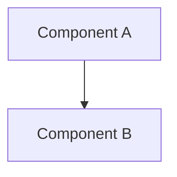

> **BLUF:** [One to three sentences. What is this document? What does it define? What is the key takeaway?]

# [Title]

## 1. Overview

[What is this? Factual description of the component, system, API, or standard being documented.]

---

## 2. Specification

[Core technical details. Tables, schemas, configurations, parameters, enums, constants.]

| Property | Value | Notes |
|:---------|:------|:------|
| | | |

---

## 3. Architecture

[Mermaid diagram showing structure, relationships, data flow.]



---

## 4. Interface / API

[Public API surface. Function signatures, endpoints, message formats.]

```
function_name(param: type) -> return_type
```

---

## 5. Configuration

[Config files, environment variables, runtime options.]

```yaml
# example config
key: value
```

---

## 6. Compliance Checklist

- [ ] All sections filled with factual content
- [ ] Mermaid diagrams render correctly
- [ ] No placeholder text (TODO, TBD)
- [ ] YAML frontmatter complete
- [ ] BLUF is ≤3 sentences

---

> *[Closing aphorism or design principle]*
